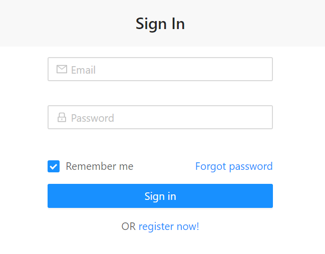
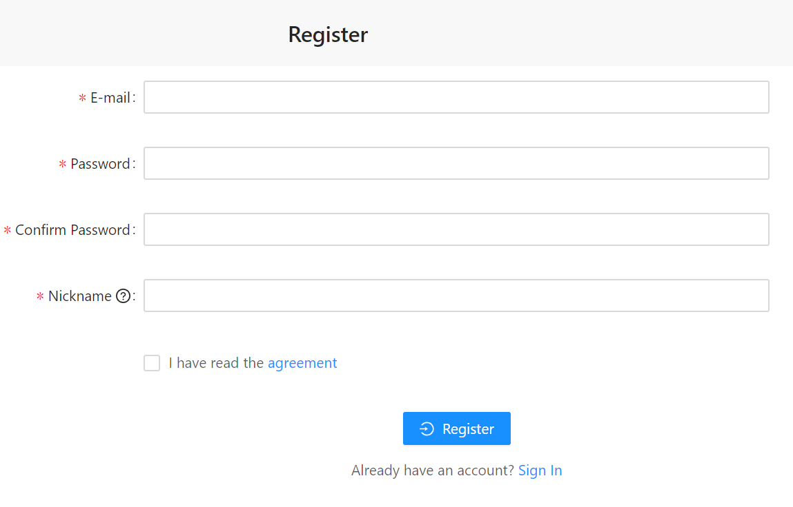
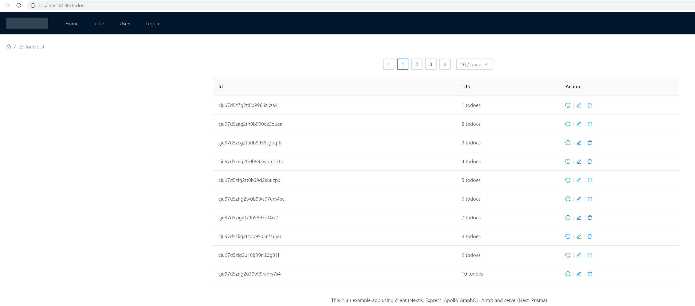

# Description

A todo list application in nodejs

## Backend

Use nest, prisma and apollo server. see [Details](./doc/api-nest.md).

## Frontend

Use next.js, antd, apollo client. see [Details](./doc/web-next-antd.md).

# Roadmaps

- [x] Support: Mac, Linux and Windows
- [x] Database: [Prisma](https://www.prisma.io/) replaces traditional ORMs
- [x] Server: integration between [nest](https://nestjs.com) and [Next.js](https://nextjs.org)
- [x] UI: integration between [Next.js](https://nextjs.org) and [Ant Design](https://ant.design/)
- [x] GraphQL: [Apollo client and server](https://www.apollographql.com)
- [x] Pagination: integration between [Ant Design](https://ant.design/) and [GraphQL](https://www.apollographql.com)
- [x] Auth: [JWT token]() (email & password)
- [ ] Auth: [passport-github2](https://github.com/cfsghost/passport-github) (GitHub login)
- [ ] Auth: [passport-twitter](https://github.com/jaredhanson/passport-twitter) (Twitter login)
- [x] Feature: register, authentication, logout and todo list
- [ ] Test: unit tests
- [ ] Test: e2e tests

# Test UI

## Login
Please user admin@example.com/admin to login.  

## Register

## Todo list

